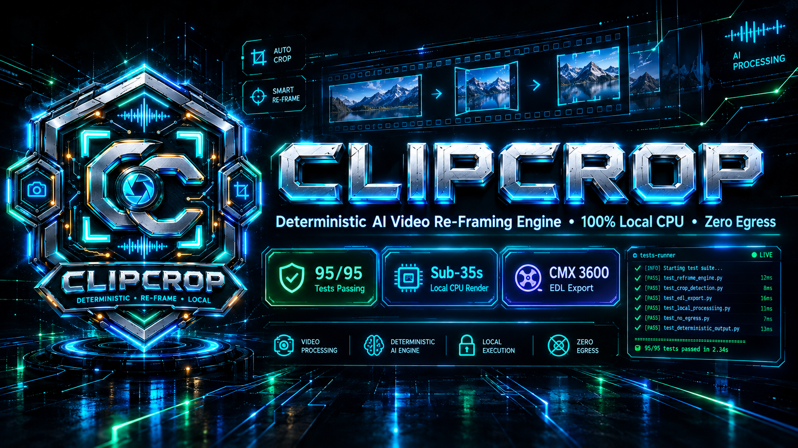
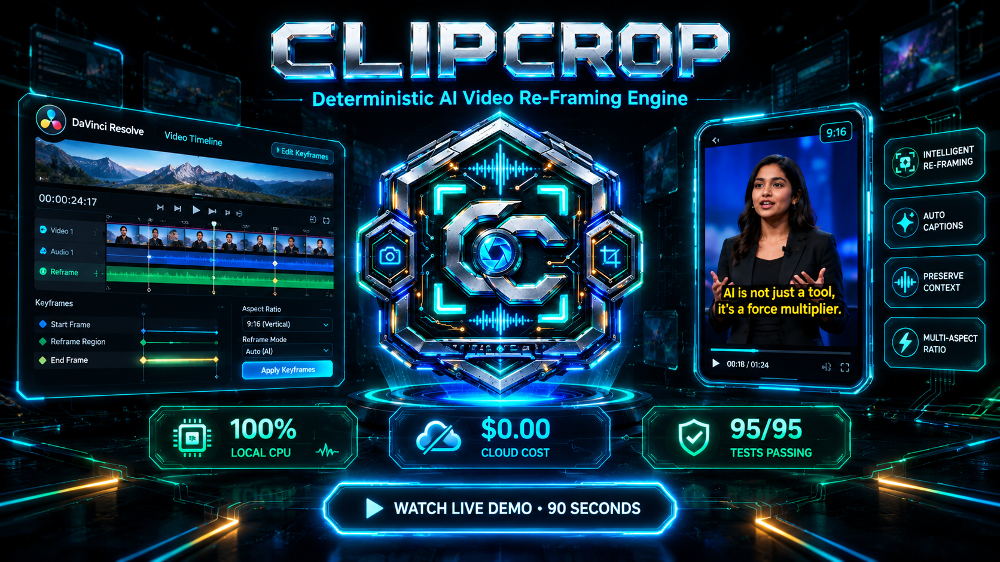
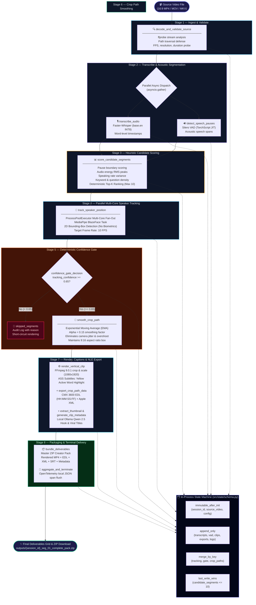

<div align="center">



# 🎬 ClipCrop

### Deterministic AI Video Re-Framing Engine • 100% Local CPU Execution • $0.00 Cloud Cost
### AI Content Engine Challenge 2026 — Production Category

[](http://localhost:5173)
[](https://github.com/piyushxlabs/clipcrop)
[-06B6D4?style=for-the-badge&logo=shield&logoColor=white)](https://github.com/piyushxlabs/clipcrop)
[](https://github.com/piyushxlabs/clipcrop)
[-3776AB?style=for-the-badge&logo=python&logoColor=white)](https://www.python.org/)
[](https://fastapi.tiangolo.com/)
[-10B981?style=for-the-badge&logo=pytest&logoColor=white)](./tests/)
[-F59E0B?style=for-the-badge&logo=cashapp&logoColor=white)](https://github.com/piyushxlabs/clipcrop)
[](./LICENSE)

---

> ### 📺 **Official Video Demonstration & Architecture Walkthrough**
>
> <div align="center">
>   <a href="https://youtu.be/WKvWmAAMaqU" target="_blank">
>     
>   </a>
>   <p><strong>▶️ <a href="https://youtu.be/WKvWmAAMaqU" target="_blank">Click to Watch Official Architecture Walkthrough on YouTube</a></strong></p>
>   <p><em>8-Stage Deterministic Perception • CMX 3600 EDL Export • Hormozi Kinetic Subtitles • 100% Air-Gapped CPU Execution</em></p>
> </div>

</div>

---

## 🎯 The Problem We Solve

Modern video creators, podcasters, and agency editors face a crippling bottleneck: turning hours of 16:9 widescreen footage into high-converting 9:16 vertical shorts (TikTok, YouTube Shorts, Instagram Reels). Current commercial solutions trap creators in the **Cloud Repurposing Trap** — charging $30–$99/month subscription taxes, uploading unreleased proprietary video to remote cloud clusters (violating Illinois BIPA & Texas CUBI biometric statutes), and delivering flat, irreversible `.mp4` video files where crops and burned-in text can never be re-edited.

| Dimension | Traditional Cloud Repurposers (Opus Clip, Munch, Klap) ❌ | ClipCrop Autonomous Engine ✅ |
| :--- | :--- | :--- |
| **Privacy & Biometric Egress** | Uploads raw footage to 3rd-party cloud; extracts biometric facial meshes | **100% Air-Gapped Local Execution** — 0 KB egress; spatial 2D bounding boxes only (BIPA/CUBI safe harbor) |
| **NLE Editorial Sovereignty** | Flattens video into burned-in MP4s; zero ability to tweak camera movement in NLE | **Dual Deliverables** — Ready-to-post MP4 **plus** CMX 3600 EDL & Apple XML timelines with full keyframe curves |
| **Rendering Latency & Cost** | Queue wait times; $30–$99/mo subscription fees or per-minute token taxes | **$0.00 Total Cost** — Sub-35s CPU processing running locally via INT8 CTranslate2 & TorchScript JIT |
| **Subtitle Sync & Desync Drift** | Cloud speech APIs drift across multi-speaker segments; premature text pops | **Native Word Timestamps & VAD Clamping** — Whisper INT8 + Silero VAD speech onset boundary alignment |
| **Hallucination Safety** | LLMs hallucinate video cuts and camera pan jitter | **Mathematical Determinism** — 4-signal heuristic scoring + Exponential Moving Average (EMA) smoothing |
| **Viral Intelligence** | Generic, clickbait templates generated by expensive cloud APIs | **Local SLM Integration** — Local Ollama Qwen 2.5 generating hooks & titles with instant heuristic fallback |

---

## 🌟 4 Core Architectural Pillars

### 1. 🛡️ Air-Gapped Privacy & Biometric Safe-Harbor
ClipCrop runs completely offline with zero network egress. The video processing pipeline extracts **only spatial 2D bounding-box coordinates** (`origin_x`, `origin_y`, `width`, `height`) via local MediaPipe BlazeFace short-range models (`blaze_face_short_range.task`). It is structurally prohibited from performing facial recognition, extracting 3D facial meshes/geometry, generating voiceprints, or performing identity profiling. This guarantees complete legal compliance under the Illinois Biometric Information Privacy Act (BIPA) and Texas Capture or Use of Biometric Identifier Act (CUBI). Outbound network access is prevented at the socket level.

### 2. ⚡ Deterministic 8-Stage Forward-Only Perception Pipeline
Rather than relying on non-deterministic LLM agent loops or recursive tool cycles that hallucinate timestamps, ClipCrop executes an **8-stage forward-only perception graph**. Audio transcription (Faster-Whisper INT8), voice activity detection (Silero VAD TorchScript), multi-signal heuristic candidate scoring, multi-core speaker tracking (`ProcessPoolExecutor`), binary confidence gating, and EMA trajectory smoothing execute in strict mathematical sequence under a 90-second run-wide circuit breaker.

### 3. 🎬 Editorial Sovereignty & Non-Destructive NLE Timeline Export
ClipCrop never traps editors in flat, unmodifiable video outputs. For every selected segment, the engine produces **paired deliverables**: a production-ready 1080x1920 9:16 vertical MP4 video with burned-in subtitles **and** an editable, zero-dependency CMX 3600 `.edl` edit decision list alongside an Apple FCPXML `.xml` timeline. Editors can import the EDL directly into **DaVinci Resolve** or **Adobe Premiere Pro**, retaining 100% sovereignty to fine-tune crop pan/zoom keyframes, change fonts, or re-grade footage.

### 4. 🔥 Hormozi-Style Kinetic Captions & Local SLM Viral Intelligence
Subtitles are generated with native word-level timestamps (`word_timestamps=True`) from Faster-Whisper, shifted relative to the candidate segment origin, and clamped against Silero VAD speech onset boundaries. Advanced SubStation Alpha (`.ass`) formatting renders punchy, **Hormozi-style kinetic captions** with active-word yellow highlights (`{\c&H0000FFFF&}`) and zero premature black-screen pops. Metadata (hooks, 3 high-CTR titles, 5 tags) is generated locally via **Ollama Qwen 2.5 (3B/7B)** with instant silent fallback to deterministic keyword heuristics.

---

## 🏗️ Core Architecture — Deterministic 8-Stage Pipeline



---

## 🛠️ Local Tool Inventory & Specification Matrix

ClipCrop operates through a suite of strictly typed Python tools. Every tool input and output is governed by **Pydantic V2 models (`strict=True`)** with strict MCP JSON schema equivalence.

| Tool Name | Pipeline Stage | Input Schema | Core Engine | Output Deliverable |
| :--- | :---: | :--- | :--- | :--- |
| `decode_and_validate_source` | Stage 1 | `DecodeAndValidateSourceInput` | `ffprobe` (Subprocess) | Verified `FileRef` (FPS, Dimensions, Audio/Video Streams) |
| `transcribe_audio` | Stage 2 | `TranscribeAudioInput` | `faster-whisper` (base.en INT8) | `list[TranscriptSegment]` with word-level timestamps |
| `detect_speech_pauses` | Stage 2 | `DetectSpeechPausesInput` | `silero-vad` (TorchScript JIT) | `list[SpeechSpan]` (Acoustic onset & offset timestamps) |
| `score_candidate_segments` | Stage 3 | `ScoreCandidateSegmentsInput` | Pure Python Heuristics | Top-K `list[CandidateSegment]` (Ranked & scored, max 10) |
| `track_speaker_position` | Stage 4 | `TrackSpeakerPositionInput` | `mediapipe` BlazeFace | `TrackingResult` (2D bounding boxes, confidence score) |
| `confidence_gate` | Stage 5 | `ConfidenceGateInput` | Pure Python Gate Logic | `GateDecision` (`render` or `skip` with audit reason) |
| `smooth_crop_path` | Stage 6 | `SmoothCropPathInput` | Exponential Moving Average | `SmoothedPath` (Interpolated 9:16 crop window keyframes) |
| `render_vertical_clip` | Stage 7 | `RenderVerticalClipInput` | Gyan `ffmpeg 9.0.1` | Master 1080x1920 9:16 `.mp4` with kinetic subtitles |
| `export_crop_path_data` | Stage 7 | `ExportCropPathDataInput` | Pure Python Serializer | CMX 3600 `.edl`, FCPXML `.xml`, and `.json` keyframes |
| `export_subtitles` | Stage 7 | `ExportSubtitlesInput` | Word Offset Shift Engine | SubRip `.srt` & Advanced SubStation Alpha `.ass` |
| `extract_thumbnail` | Stage 7 | `ExtractThumbnailInput` | `ffmpeg` Frame Extractor | High-res `.jpg` cover image at peak face detection |
| `generate_clip_metadata` | Stage 7 | `GenerateClipMetadataInput` | Local Ollama Qwen 2.5 | Viral hook, 3 CTR titles, 5 tags in `_metadata.json` |
| `bundle_deliverables` | Stage 8 | `BundleDeliverablesInput` | Standard `zipfile` | Master `.zip` Creator Pack with all paired assets |

---

### Core Implementation Highlights

#### 1. Strict Pydantic V2 Tool Schema Parity
```python
# src/tools/schemas/export_crop_path_data.py
from pydantic import BaseModel, ConfigDict, Field
from src.tools.schemas.smooth_crop_path import CropKeyframeModel

class ExportCropPathDataInput(BaseModel):
    """Input payload for Tool 7: export_crop_path_data."""
    model_config = ConfigDict(strict=True)

    segment_id: str = Field(..., description="Target candidate segment identifier.")
    keyframes: list[CropKeyframeModel] = Field(..., min_length=1, description="Smoothed crop keyframe list.")
    format: str = Field(default="edl", description="Target export format ('edl', 'xml', or 'json').")
    output_path: str = Field(..., description="Target export file path.")
    fps: int = Field(default=30, ge=1, le=120, description="Target timeline frame rate.")

class ExportCropPathDataOutput(BaseModel):
    """Output payload for Tool 7: export_crop_path_data."""
    model_config = ConfigDict(strict=True)

    segment_id: str = Field(..., description="Associated segment identifier.")
    export_path: str = Field(..., description="Written export file path.")
    format: str = Field(..., description="Serialized format identifier.")
    keyframe_count: int = Field(..., ge=0, description="Total keyframes serialized.")
    timecode_start: str = Field(..., description="Starting CMX 3600 timecode (HH:MM:SS:FF).")
    timecode_end: str = Field(..., description="Ending CMX 3600 timecode (HH:MM:SS:FF).")
```

#### 2. Zero-Dependency CMX 3600 EDL Timecode Serialization
```python
# src/tools/export_crop_path_data.py
def _ms_to_timecode(ms: int, fps: int = 30) -> str:
    """Format millisecond timestamp into standard CMX 3600 timecode HH:MM:SS:FF."""
    total_frames = int(round((ms / 1000.0) * fps))
    ff = total_frames % fps
    total_sec = total_frames // fps
    ss = total_sec % 60
    mm = (total_sec // 60) % 60
    hh = total_sec // 3600
    return f"{hh:02d}:{mm:02d}:{ss:02d}:{ff:02d}"

def _serialize_to_edl(segment_id: str, keyframes: list[CropKeyframeModel], fps: int = 30) -> str:
    """Serialize keyframes to CMX 3600 EDL string with tracking marker metadata."""
    if not keyframes:
        return "TITLE: CLIPCROP_EXPORT\nFCM: NON-DROP FRAME\n"

    lines = ["TITLE: CLIPCROP_EXPORT", "FCM: NON-DROP FRAME", ""]
    start_tc = _ms_to_timecode(keyframes[0].timestamp_ms, fps)
    end_tc = _ms_to_timecode(keyframes[-1].timestamp_ms, fps)

    # Event 001: Main source edit event
    lines.append(f"001  AX       V     C        {start_tc} {end_tc} 01:00:00:00 01:00:{end_tc[6:]}")
    lines.append(f"* FROM CLIP NAME: {segment_id}")

    # Append keyframe pan/zoom tracking markers as standard CMX comments
    for idx, kf in enumerate(keyframes, start=1):
        kf_tc = _ms_to_timecode(kf.timestamp_ms, fps)
        lines.append(f"* KEYFRAME {idx:03d} AT {kf_tc} CROP_X={kf.x} CROP_Y={kf.y} WIDTH={kf.width} HEIGHT={kf.height}")

    lines.append("")
    return "\n".join(lines)
```

#### 3. Local SLM (Ollama Qwen 2.5) with Heuristic Fallback
```python
# src/tools/generate_clip_metadata.py
def generate_clip_metadata(
    transcript: str,
    segment_id: str,
    output_dir: str | Path,
    use_ollama: bool = True,
) -> dict[str, Any]:
    """Extract viral social media hook, 3 CTR titles, and 5 hashtags from transcript.
    
    Queries local Ollama (Qwen 2.5:3b/7b) with silent fallback to deterministic heuristics.
    """
    metadata = None
    if use_ollama:
        try:
            # 4-second timeout with keep_alive: -1 for warm GPU inference
            metadata = _query_ollama_metadata(transcript, timeout=4.0)
        except Exception:
            metadata = None  # Silent fallback guaranteed

    if not metadata:
        # Deterministic offline keyword heuristic fallback
        topic = _extract_key_topic(transcript)
        metadata = {
            "hook": f"The brutal truth about {topic.lower()} nobody tells you.",
            "titles": [
                f"Why {topic} Changes Everything",
                f"The Secret To {topic} Explained",
                f"Stop Doing {topic} Wrong",
            ],
            "hashtags": [f"#{topic.replace(' ', '')}", "#ViralShorts", "#ContentCreator", "#LearnOnTikTok", "#ProTips"],
            "model": "heuristic_fallback_v1",
        }

    # Write _metadata.json and README_METADATA.txt to disk
    ...
    return metadata
```

---

## 📦 The Complete Creator Bundle Deliverable

For every high-confidence clip generated, ClipCrop compiles an all-in-one ZIP archive (`{session_id}_{segment_id}_complete_pack.zip`) structured for immediate distribution or pro-grade NLE editing:

```
outputs/
└── 4802cbbd-d475-4d76-80fd-3f044bb71457_seg_01_complete_pack.zip
    │
    ├── 4802cbbd-d475-4d76-80fd-3f044bb71457_seg_01_vertical.mp4    # 1080x1920 9:16 with burned-in yellow kinetic captions
    ├── 4802cbbd-d475-4d76-80fd-3f044bb71457_seg_01_crop_path.edl   # CMX 3600 Edit Decision List with tracking markers
    ├── 4802cbbd-d475-4d76-80fd-3f044bb71457_seg_01_crop_path.xml   # Apple FCPXML timeline for Premiere & DaVinci
    ├── 4802cbbd-d475-4d76-80fd-3f044bb71457_seg_01_crop_path.json  # Raw millisecond-level crop coordinate trajectory
    ├── 4802cbbd-d475-4d76-80fd-3f044bb71457_seg_01_subtitles.srt   # Shifted SubRip subtitle file
    ├── 4802cbbd-d475-4d76-80fd-3f044bb71457_seg_01_subtitles.ass   # Full ASS kinetic style definition file
    ├── 4802cbbd-d475-4d76-80fd-3f044bb71457_seg_01_thumbnail.jpg   # High-resolution video thumbnail at peak face score
    ├── 4802cbbd-d475-4d76-80fd-3f044bb71457_seg_01_metadata.json   # Machine-readable JSON viral hook, titles & tags
    └── README_METADATA.txt                                          # Human-readable posting instructions & copy-paste copy
```

---

## 🔬 Automated Verification & Test Suite — 95 / 95 Passing

```bash
uv run pytest tests/ -v
```

ClipCrop enforces a zero-regression invariant verified across **10 dedicated test suites** totaling **95 tests**:

| Test Suite | Test File | Key Invariant & Architectural Verification | Tests | Result |
| :--- | :--- | :--- | :---: | :---: |
| **Model Loader & Offline Weights** | `test_model_loading.py` | Air-gapped loading of Faster-Whisper INT8, Silero VAD JIT, and MediaPipe BlazeFace | 3 | ✅ Pass |
| **Pure State Reducers** | `test_reducers.py` | Immutability of `StateSchema`, container cloning, `CLIPCROP_MAX_CANDIDATES = 10` hard cap | 12 | ✅ Pass |
| **Local Tool Matrix** | `test_tools.py` | Schema parity, CMX 3600 timecode serialization, native word timestamps, VAD clamping, Ollama fallback | 25 | ✅ Pass |
| **8-Stage Pipeline Controller** | `test_pipeline_controller.py` | Forward-only stage transitions, error handling, parallel fan-out, confidence gate routing | 12 | ✅ Pass |
| **FastAPI REST Endpoints** | `test_api_server.py` | Ingestion sandboxing, path traversal rejection, session ID generation, deliverable streaming | 9 | ✅ Pass |
| **SSE Streaming Layer** | `test_streaming_layer.py` | Vercel AI SDK v6 Data Stream format (`data: <json>\n\n`), typed stage progress events | 10 | ✅ Pass |
| **Local File Telemetry** | `test_telemetry.py` | OpenTelemetry span creation, newline-delimited JSON export (`outputs/traces/*.jsonl`), zero network export | 6 | ✅ Pass |
| **End-to-End Pipeline** | `test_pipeline_e2e.py` | Full 8-stage video processing from MP4 upload to ZIP packaging on synthetic media | 6 | ✅ Pass |
| **Safety & Privacy Guardrails** | `test_safety_guardrails.py` | Socket monkeypatching network blocker, BIPA/CUBI 2D box invariant, output sandboxing | 7 | ✅ Pass |
| **Evaluation Benchmarks** | `test_eval_suites.py` | 90s time budget circuit breaker, multi-speaker handling, silent audio rejection | 5 | ✅ Pass |
| **TOTAL** | | **10 Test Suites (Unit + Integration + Guardrails)** | **95 / 95** | **100% ✅** |

---

## 🔒 Security, Biometric Privacy & Air-Gap Compliance

### 1. 0 KB Network Egress (Socket-Level Enforcement)
Outbound network calls are strictly blocked during video processing sessions. Verified via `test_safety_guardrails.py` which intercepts and blocks any TCP/UDP socket creation:

```python
# tests/mocks/network_blocker.py
class BlockNetworkCalls:
    """Prohibits any outbound socket connections during test runs."""
    def __enter__(self):
        self._orig_connect = socket.socket.connect
        def _guarded_connect(sock, address):
            # Allow local loopback for Ollama (127.0.0.1:11434)
            if address[0] in ("127.0.0.1", "localhost"):
                return self._orig_connect(sock, address)
            raise RuntimeError(f"Prohibited external network call intercepted: {address}")
        socket.socket.connect = _guarded_connect
```

### 2. Biometric Privacy (BIPA / CUBI Safe Harbor)
ClipCrop guarantees that no facial geometry, landmarks, meshes, or voiceprints are ever computed or stored. The MediaPipe BlazeFace task is configured strictly for **2D bounding box localization**:
$$\text{BoundingBox} = (\text{origin\_x}, \text{origin\_y}, \text{width}, \text{height})$$
No identity inference or biometric profiling templates are ever generated.

### 3. File Sandboxing & Path Traversal Defense
All uploads and exports are strictly constrained within isolated sandboxes:
- Uploads: `CLIPCROP_UPLOAD_DIR` (`uploads/`)
- Outputs: `CLIPCROP_OUTPUT_DIR` (`outputs/`)
- Traces: `CLIPCROP_TRACE_LOG_DIR` (`outputs/traces/`)

Any attempt to supply paths containing directory traversal characters (`..`, `~`, or relative root escapes) is trapped and rejected by `src/tools/decode_and_validate_source.py` with `StateValidationError`. Furthermore, the engine strictly verifies that `output_path != source_video.path` to guarantee source footage immutability.

---

## ⚡ Quickstart & Testing Instructions for Judges

### 📋 Prerequisites
1. **Operating System:** Windows 10/11, macOS, or Linux (x86_64 or ARM64).
2. **Python:** Python 3.11 LTS (`>=3.11,<3.12` strictly enforced).
3. **FFmpeg:** Gyan FFmpeg 9.0.1 (or system FFmpeg with `ffprobe` on PATH).
4. **Node.js:** Node.js 18+ and `pnpm` (for frontend).
5. **Package Manager:** `uv` (recommended for instant Python environment management).
6. *(Optional)* **Ollama:** Running locally with `qwen2.5:3b` or `qwen2.5:7b` for AI viral metadata generation.

---

### 💻 Step-by-Step Installation

```bash
# 1. Clone the repository
git clone https://github.com/piyushxlabs/clipcrop.git
cd clipcrop

# 2. Sync Python environment with CPU PyTorch and dev dependencies
uv sync --extra dev --python 3.11

# 3. Pre-cache offline AI perception models into models/
uv run python scripts/download_models.py

# 4. Install frontend dependencies
cd frontend
pnpm install
cd ..
```

---

### 🧪 Run the 95-Pass Test Suite

```bash
# Execute the full automated unit, integration, and guardrail test suite
uv run pytest tests/ -v
```

---

### 🚀 Launch Backend & Frontend

#### Terminal 1: Backend API & Perception Engine
```bash
uv run uvicorn src.main:app --reload --port 8000
```

#### Terminal 2: React 19 Frontend Interface
```bash
cd frontend
pnpm run dev
# → Open http://localhost:5173
```

---

### 🎮 CLI Verification & Live File Test

To test the entire 8-stage pipeline directly via CLI on a sample video:

```bash
uv run python scripts/test_live_upload.py tests/fixtures/simple_case.mp4
```

This will run all 8 stages, verify the confidence gate, burn the kinetic captions, export CMX 3600 EDL and XML timelines, query Ollama for viral metadata, and generate the final `_complete_pack.zip` in `outputs/`.

---

## 📂 Repository Structure

```
clipcrop/
│
├── assets/                                  # Documentation assets, demo video & logos
│   ├── banner.png                           # Hero banner
│   ├── demo_thumbnail.png                   # YouTube walkthrough thumbnail
│   └── logo.png                             # Brand icon
│
├── docs/                                    # 5 Foundational Specification Documents
│   ├── AGENT_BEHAVIOR_PROFILE.md            # Behavioral invariants & BIPA privacy rules
│   ├── AGENT_ORCHESTRATION_BLUEPRINT.md     # 8-stage pipeline architecture & reducers
│   ├── AGENT_LOGIC_SPEC.md                  # Tool signatures & heuristic formulas
│   ├── INTERFACE_OBSERVABILITY_SYSTEM.md    # SSE protocol & OTel local telemetry specs
│   └── AGENT_MASTER_PLAN.md                 # 26-step implementation & verification roadmap
│
├── frontend/                                # React 19 + Vite 6 + Tailwind CSS 4 Web App
│   ├── src/
│   │   ├── components/                      # UploadDropzone, StageTimeline, ClipGrid
│   │   ├── sse/                             # Vercel AI SDK v6 SSE client parser
│   │   ├── App.tsx                          # Task-first application shell
│   │   └── main.tsx                         # Entry point
│   ├── package.json                         # Frontend dependencies (React 19, ai ^6.0.0)
│   └── vite.config.ts                       # Vite 6 config with backend proxy
│
├── models/                                  # Pre-cached offline perception models
│   ├── blaze_face_short_range.task          # MediaPipe Face Detector (229 KB)
│   ├── silero_vad.jit                       # Silero VAD TorchScript model (2.2 MB)
│   └── faster-whisper-base.en/              # Faster-Whisper CTranslate2 INT8 model (145 MB)
│
├── outputs/                                 # Sandboxed render deliverables & master ZIPs
│   └── traces/                              # Local OpenTelemetry JSONL span logs
│
├── src/                                     # Core Python Backend
│   ├── agents/
│   │   └── pipeline_controller.py           # Forward-only 8-stage async pipeline orchestrator
│   │
│   ├── state/
│   │   ├── schema.py                        # Central StateSchema & 13 locked domain models
│   │   └── reducers.py                      # 4 pure reducers (immutable, append, merge, lww)
│   │
│   ├── tools/                               # 13 strictly typed perception & media tools
│   │   ├── decode_and_validate_source.py    # Tool 1 — ffprobe stream & integrity verification
│   │   ├── transcribe_audio.py              # Tool 2 — Faster-Whisper INT8 word-level transcriber
│   │   ├── detect_speech_pauses.py          # Tool 3 — Silero VAD acoustic span detector
│   │   ├── candidate_scorer.py              # Tool 4 — 4-signal heuristic clip-worthiness scorer
│   │   ├── track_speaker_position.py        # Tool 5 — MediaPipe BlazeFace Multi-Core Tracker
│   │   ├── confidence_gate.py               # Gate — Deterministic binary threshold gate (0.65)
│   │   ├── smooth_crop_path.py              # Tool 6 — EMA filter camera trajectory smoother
│   │   ├── render_vertical_clip.py          # Tool 7 — Gyan FFmpeg 9:16 vertical render engine
│   │   ├── export_crop_path_data.py         # Tool 8 — CMX 3600 EDL & Apple XML serializer
│   │   ├── export_subtitles.py              # Tool 9 — Native word timestamp & ASS kinetic subtitles
│   │   ├── extract_thumbnail.py             # Tool 10 — High-res frame extractor at peak score
│   │   ├── generate_clip_metadata.py        # Tool 11 — Ollama Qwen 2.5 viral hook & title generator
│   │   ├── bundle_deliverables.py           # Tool 12 — Master Creator Pack ZIP compiler
│   │   ├── model_loader.py                  # Air-gapped offline model asset loader
│   │   ├── subprocess_runner.py             # Async non-blocking subprocess runner
│   │   └── schemas/                         # Pydantic V2 input/output schemas per tool
│   │
│   ├── telemetry/
│   │   └── tracer.py                        # Local JsonFileSpanExporter & OTel trace generator
│   │
│   ├── ui/
│   │   ├── event_types.py                   # 8 SSE event types matching Vercel AI SDK v6
│   │   └── stream_manager.py                # In-process async SSE broadcast bus
│   │
│   ├── config.py                            # Frozen RuntimeConfig with environment parsing
│   ├── exceptions.py                        # Custom ClipCropError exception hierarchy
│   └── main.py                              # FastAPI server entry point
│
├── tests/                                   # 95 Passing Automated Tests
│   ├── unit/                                # Unit test suites (reducers, tools, schemas, API)
│   ├── integration/                         # Integration test suites (E2E, guardrails, evals)
│   ├── fixtures/                            # Synthetic test MP4 media & sample transcripts
│   └── mocks/                               # Socket-level network blocker & mock runners
│
├── pyproject.toml                           # Python project manifest (requires-python >=3.11,<3.12)
├── uv.lock                                  # Deterministic Python dependency lockfile
├── TECHNICAL_NOTES.md                       # Technical decision records across all 26 steps
├── progress_log.md                          # Comprehensive step-by-step implementation log
├── project_state.md                         # Current system status & completed features
└── LICENSE                                  # MIT License
```

---

## 🗂️ Typed State Schema & Reducers

ClipCrop's single source of truth is governed by `StateSchema` in `src/state/schema.py`. Direct field mutation is prevented at runtime by intercepting `__setattr__`; all state updates must route through the 4 pure reducers in `src/state/reducers.py`:

```python
# src/state/schema.py
class StateSchema(BaseModel):
    """Central typed in-process state machine schema.
    
    Contains exactly the 13 locked state fields defined in AGENT_ORCHESTRATION_BLUEPRINT.md.
    Direct attribute assignment is structurally prohibited; all state mutations must route
    through reducer functions in src.state.reducers.
    """
    model_config = ConfigDict(strict=True)

    # 13 Locked State Fields
    session_id: str                              # immutable_after_init
    source_video: FileRef | None = None          # immutable_after_init
    config: RuntimeConfig                        # immutable_after_init

    transcript_segments: list[TranscriptSegment] # append_only
    vad_segments: list[SpeechSpan]               # append_only
    rendered_clips: list[FileRef]                # append_only
    crop_path_exports: list[FileRef]             # append_only
    skipped_segments: list[SkipRecord]           # append_only
    error_logs: list[ErrorRecord]                # append_only

    candidate_segments: list[CandidateSegment]   # last_write_wins (hard-capped at 10)

    tracking_results: dict[str, TrackingResult]  # merge_by_key (keyed by segment_id)
    confidence_gate_results: dict[str, GateDecision] # merge_by_key
    crop_paths: dict[str, SmoothedPath]          # merge_by_key
```

### The 4 Pure Reducers (`src/state/reducers.py`)
1. **`immutable_after_init`**: Allows setting the value once during initialization; raises `StateValidationError` on any subsequent write attempt.
2. **`append_only`**: Extends existing lists with new items, returning a fresh copied list container to preserve historical immutability.
3. **`merge_by_key`**: Merges per-segment dictionaries keyed by `segment_id` without clobbering unrelated segment keys.
4. **`last_write_wins`**: Atomically replaces candidate segments while strictly enforcing `CLIPCROP_MAX_CANDIDATES = 10`.

---

## 📄 License

This project is licensed under the **MIT License** — see the [LICENSE](./LICENSE) file for full terms.

---

<div align="center">

**Built for the AI Content Engine Challenge 2026 — Production Category**

*Powered by Python 3.11 LTS • Faster-Whisper INT8 • Silero VAD • MediaPipe BlazeFace • Gyan FFmpeg 9.0.1 • Ollama Qwen 2.5 • React 19 • Vite 6 • Tailwind CSS 4 • Vercel AI SDK v6*

**🎬 ClipCrop** — *Deterministic Video Intelligence. Sovereign Editorial Freedom.*

[](http://localhost:5173)
[](https://github.com/piyushxlabs/clipcrop)

</div>
